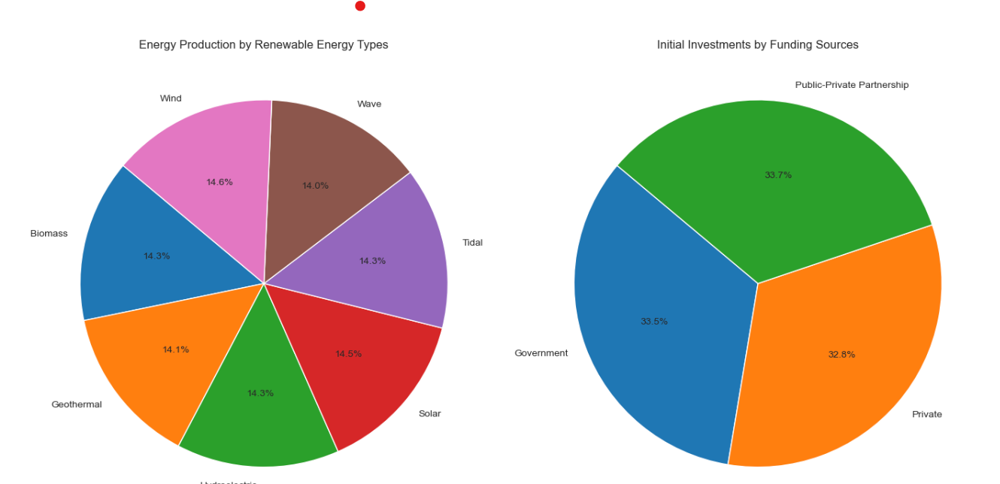
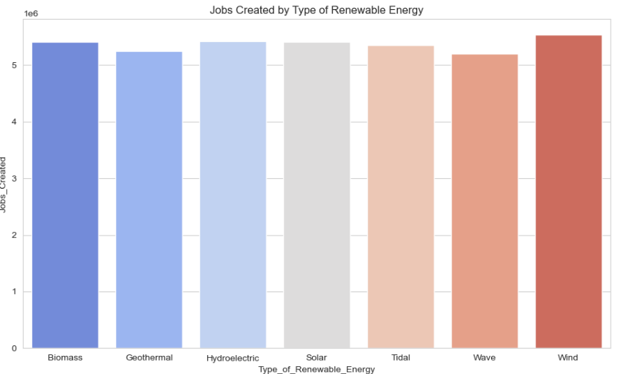
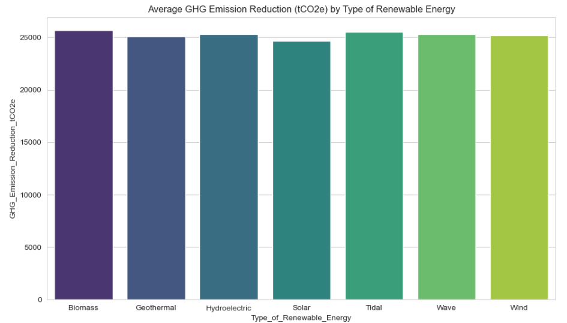
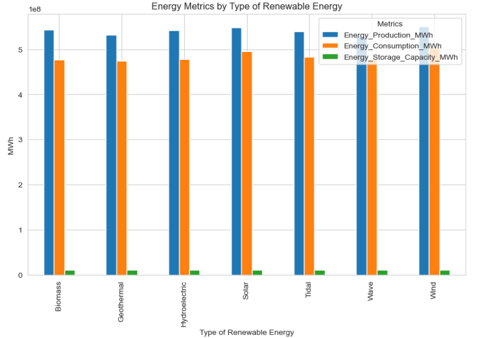
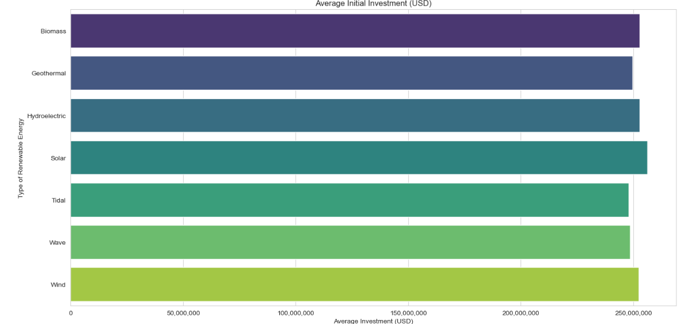
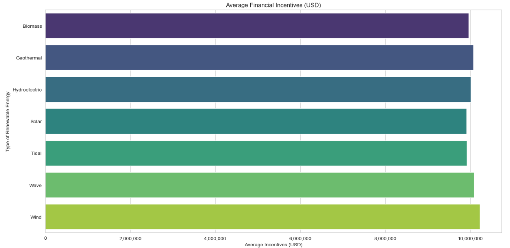

## Introduction

Investing in renewable energies is crucial given current climate changes as it reduces greenhouse gas emissions, mitigating global warming and extreme weather events. Renewables, such as solar and wind, provide sustainable, low-carbon energy sources, decreasing dependence on fossil fuels and enhancing energy security. Additionally, they stimulate economic growth through job creation and innovation. Transitioning to renewables is vital for protecting ecosystems, public health, and ensuring a livable planet for future generations.

This study has the objective to understand the types of renewable energy available, their capacity and also the investments made in each one. Through an Exploratory Data Analysis (EDA), let's explore it and find some relevant insights.

## Data Source and Tools

To run this data analysis we will use Python and some libreries, so it is necessary to ensure that the following libreries are installed and import them:

- Plotly Express;
- Matplotlib Pyplot;
- Matplolib Ticker
- Pandas;
- Seaborn.

The source data utilized for this analysis is available at Kaggle (https://www.kaggle.com/datasets/girumwondemagegn/dataset-for-renewable-energy-systems/data).

## Data Source Schema

This dataset is composev by the following atributes:
- **Type_of_Renewable_Energy:** Numerical code representing the type of renewable energy source (1: Solar, 2: Wind, 3: Hydroelectric, 4: Geothermal, 5: Biomass, 6: Tidal, 7: Wave).
- **Installed_Capacity_MW:** Installed capacity in megawatts (MW).
- **Energy_Production_MWh:** Yearly energy production in megawatt-hours (MWh).
- **Energy_Consumption_MWh:** Yearly energy consumption in megawatt-hours (MWh).
- **Energy_Storage_Capacity_MWh:** Energy storage capacity in megawatt-hours (MWh).
- **Storage_Efficiency_Percentage:** Efficiency of energy storage systems in percentage.
- **Grid_Integration_Level:** Numerical code representing the level of grid integration (1: Fully Integrated, 2: Partially Integrated, 3: Minimal Integration, 4: Isolated Microgrid).
- **Initial_Investment_USD:** Initial investment costs in USD.
- **Funding_Sources:** Numerical code representing the funding source (1: Government, 2: Private, 3: Public-Private Partnership).
- **Financial_Incentives_USD:** Financial incentives in USD.
- **GHG_Emission_Reduction_tCO2e:** Reduction in greenhouse gas emissions in tons of CO2 equivalent (tCO2e).
- **Air_Pollution_Reduction_Index:** Air pollution reduction index.
- **Jobs_Created:** Number of jobs created.

## Business Questions

### What are the types of renewable energy and from where the investments come?
According to the data source, we can see that the energy production in MWh per type is very similar. Also, acording to the value invested, the source of fundings has invested similar amounts also.

### What type of energy created more jobs?
For this analysis, the number of employess engaged in this investments are similar, evewn though the wind type has the higher value with 5,530,174 employees.

### What type of energy has higher potential to reduce GHG emission?
According to the findings for this study, Biomass, in average, has the highest potential of reduction with 25645.694359 tCO2e.

### What are the energy production capacity and their consumption?
For all types of sources, the current capacity is higher them their demand. So there is space to adoption with current capacity. Also it is possible to check the Wind has the highest capacity with 

### In avarege, what are the investments needed and fundings used?
According to this study, in avarege, tidal energy received more investments.

Also, about fundings used to support this investments, Wind energy are receiving higher funds.

## Findings and Further Analysis
For this project, our main goal was to find insights from the data. Here are some key findings:

- Funding Source: The top funding source is a public-private partnership, accounting for 33.6% of the total. 
- Employment: Tidal Energy employs a large number of people, with an average of 2,519 jobs created.
- GHG Emission Reduction: Biomass leads in GHG emission reduction, with an average reduction of 25,645.69 tCO2e. 
- Air Pollution Reduction: Solar energy has the highest air pollution reduction index, with an average of 51.61.
- Energy Production: Geothermal energy has the highest average energy production at 252,893.83 MWh. 
- Energy Consumption: Hydroelectric energy has the lowest average energy consumption at 221,711.58 MWh.
- Energy Storage Capacity: Biomass leads in energy storage capacity, with an average of 5,066.70 MWh.
- Initial Investment: Tidal Energy has the lowest initial investment, averaging $247,874,200.
- Financial Incentives: Wind energy receives the highest financial incentives, averaging $10,232,840

For further studies, the suggestion is to explore the relationship between:
- GHG emissions with the cost of investiments and define the best scenario;
- Potential of reduction in emissions with available funds;
- The social and economic impact that would be created considering the new jobs that would be created.

However, to complete this analysis it important to check the possibility to collect extra data regarding the geography and energy sources availablity. It will impact the definition depending the country, for exemple. 

